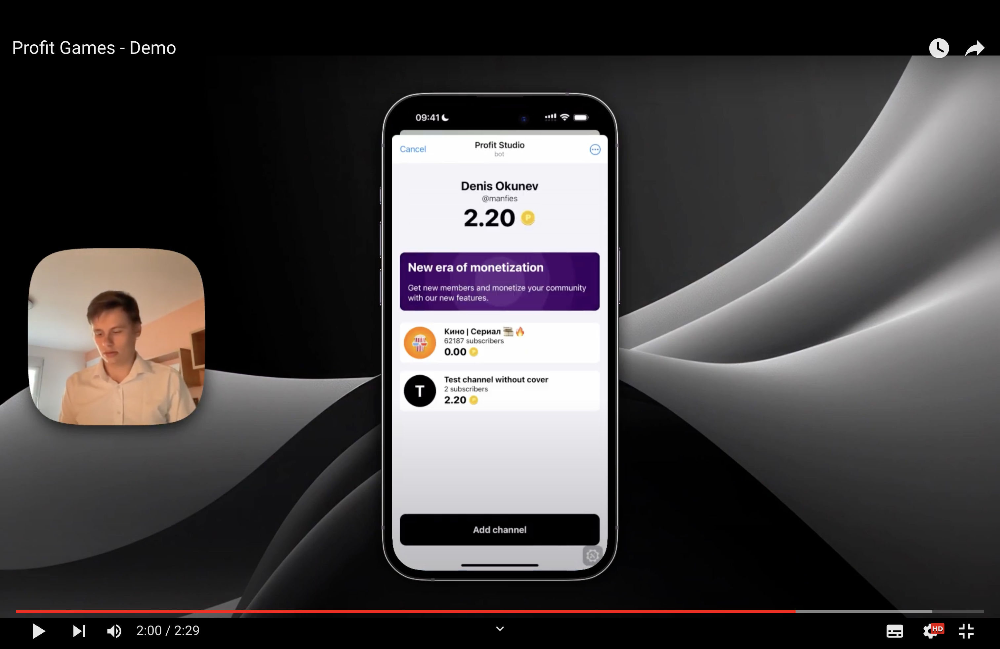

## Vision

PROFIT is a gaming platform for monetizing Telegram channels. Users earn tokens through mini-games, while authors gain income and attract new subscribers.

## Description

PROFIT is a gaming platform that allows monetization of Telegram channels through a variety of mini-games and activities. Users can earn tokens by participating in different games and use them to purchase boosters with TON cryptocurrency. These gaming mechanics make interacting with content engaging and encourage audience activity.

The project includes two mini-apps: PROFIT CHANNEL for users and PROFIT STUDIO for channel authors. In PROFIT STUDIO, authors can add their channels, earn tokens for each interaction, and analyze activity to optimize content and increase revenue. PROFIT also helps attract new subscribers by providing authors with additional tools to promote their channels.

The pilot project, PROFIT CHANNEL, showcases the platform’s potential through a simple game mechanic where users can earn tokens and buy boosters like auto-clickers that work offline. This pilot project demonstrates the platform’s capabilities in creating active communities and effective monetization. PROFIT turns ordinary content interaction into an exciting gaming experience, opening new horizons for Telegram authors and users.

Studio: [https://t.me/ProfitChannelBot/ProfitChannel](https://t.me/ProfitChannelBot/ProfitStudio)

Pilot ame: [https://t.me/ProfitChannelBot/ProfitChannel](https://t.me/ProfitChannelBot/ProfitChannel)

[Presentation of the PROFIT project](https://docs.google.com/presentation/d/1pXoVZodkhWOCE0AUVkAhGuvDmqIbRkNbVSvlZgyOqAo/edit#slide=id.g2e7cd21e88f_0_114)
